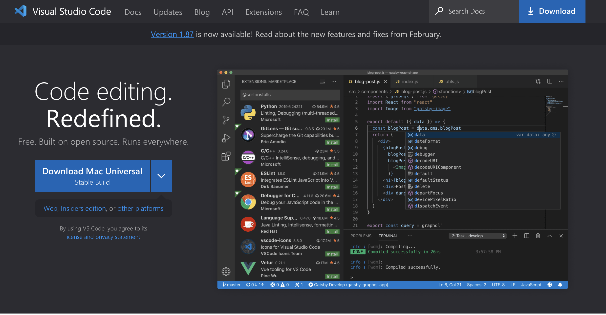
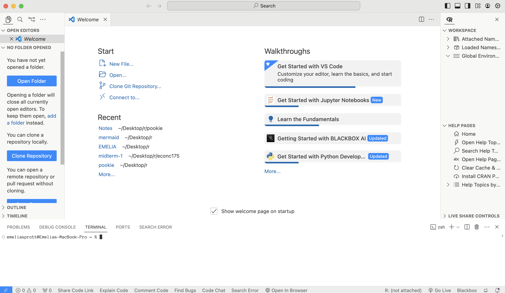

# Getting Started

Hello Pookie.

Welcome to Pookie Code. This website is going to be for notes and guides, and I'm going to put the code files for you to download on Github (This assignment will explain exactly how to do it and Github will be *really* helpful for you I promise).

Your first assignment is a lab going over the general set-up and what everything means.

## Where will I code?

### VS Code

Click to download [VS Code](https://code.visualstudio.com)

Visual Studio Code is a code editor (like google docs for code). It also has predictive typing, built-in AI,
and completely integrates with github.

Once you download and open a new window, this is what you will see.

The left sidebar is called the *primary* one. You can switch between seeing your current folder, debugging, and extensions.
The center of the screen is where the file you're editting will be. To see the right sidebar, go to View -> Appearance -> Secondary Side Bar.
When you use R or Python, this will show every thing you have named in your code.
The bottom of the screen is the terminal. This is where you interact with the actual computer. It will show you the output, or the error message of anything you run. Writing in the terminal is harder, and you can't change anything once it's run. When you need to interact directly with your computer - e.g.
to download something or manipulate an actual file structure, you'll need to use the terminal. Today you will have to use the terminal a bit,
because you'll be downloading everything.

### Github

You can think of GitHub as Pinterest, but for code. All you need to do is create an account at [github.com](https://github.com).
Use your berkeley email when you sign up, because you get free premium as a student. On VS Code, log into Cody chat with your premium github account, and you'll get free unlimited AI.

Now that you've created your Github, let's get your VS Code Set Up.

1. Open the VS Code App
2. Click View -> Extensions.
    1. Here are the extensions you need for today (I put the exact names):
        * Python
        * Quarto
        * Cody AI
        * Github Repositories
        * Path Intellisense
        * R
        * R Debugger
    2. Extensions add additional features to VS Code, not your computer. For example, the Python and R extensions help VS Code to interpret the code, but they don't allow your computer to process it. We'll take care of that in the next step.
    3. Sign in to Cody Chat with your Github account. This will give you free AI.

## Today's Assignment

Now that you're all set up, let's get started on today's assignment.